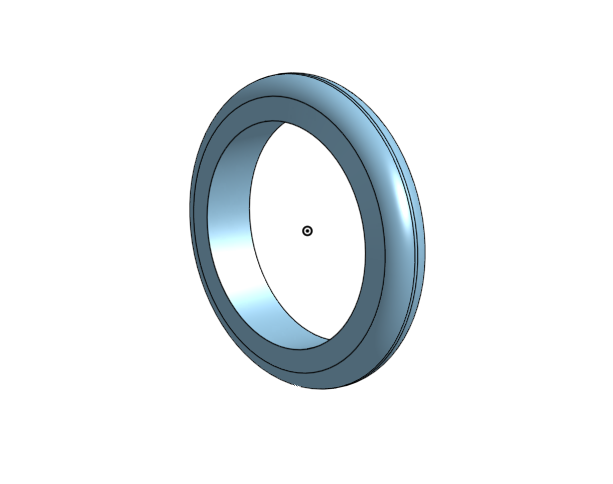

# BasicCAD

We are creating a caster.

---
## Table of Contents
* [Table of Contents](#Table-of-Contents)
* [Base](#Base)
* [Mount](#Mount)
* [Fork](#Fork)
* [Tire](#Tire)
* [Wheel](#Wheel)
* [AxleCollarBearings](#AxleCollarBearings)

## Base

### Description

The first assignment is to create the caster base.  The base's dimensions are 200 mm x 120 mm and 8 mm thick.  It has 6 holes 10 mm wide and 20 mm from the edge equally spaced along the edges.

### Evidence
https://cad.onshape.com/documents/a58b07a1dda14272a9127e53/w/5ffd47096d0216615997d739/e/41fc75208a7b19b2077d5bfc

### Image
This is how you will write image code for INTERNALLY STORED images on your repo.   just FYI.
~~~

~~~

### Reflection

This was my first Onshape part and [following along with Dr. Shields made it super easy.](https://www.youtube.com/watch?v=93BFUD-HAG8&feature=emb_title&scrlybrkr=5670f0b4)  I learned about 
* sketching (shortcut **shift-s**)
* constructions lines (shortcut **Q**)
* dimensions (shortcut **D**)
* extruding both add and remove (shortcut key **E**)
* linear patterns (no shortcut)

Onshape is awesome.  I found it really helpful to rename all my sketches.  It is going to be a GREAT year in engineering.

---

## Mount

### Description
The mount is the second part of the caster. The mounts dimensions are 120 mm by 120 mm and 8 mm thick. It has 4 holes that are 10 mm and 20mm from the wall. There is a 5th hole centered in the middle of the square that is 25 mm. 
### Evidence
https://cad.onshape.com/documents/a58b07a1dda14272a9127e53/w/5ffd47096d0216615997d739/e/320003b5696eeab62fece36c
### Image

mount part 2 screenshot.png

### Reflection
Following a video made it really easy to construct the mount with little problems. This part felt pretty easy, as it was similar to the base, part 1, that I just created. 

---

## Fork

### Description
This is the third part of the caster. The main circle is 
### Evidence
https://cad.onshape.com/documents/a58b07a1dda14272a9127e53/w/5ffd47096d0216615997d739/e/a16229fab723fbe562faf769
### Image

### Reflection
In Part 3 I learned how to fillet and chamfer for a smoother edge, and mirror for easy copy and pasting. I got more familiar with extruding. 

---

## Tire

### Description
Part 4 is the tire, which goes over the wheel on the caster. 
### Evidence
https://cad.onshape.com/documents/a58b07a1dda14272a9127e53/w/5ffd47096d0216615997d739/e/659d4a3cbdc291ae85c779dd
### Image

### Reflection
WIth this project, I learned some dimensioning tricks, such as how to dimension an angle and diameter. I also practiced revolving a sketch.I practiced filleting, revolving, and circular patterns.

---

## Wheel

### Description
The tire will go over this wheel. This is one of the last parts to the caster. 
### Evidence
https://cad.onshape.com/documents/a58b07a1dda14272a9127e53/w/5ffd47096d0216615997d739/e/748eeb9164d24b5d22324fea
### Image

### Reflection
I practiced filleting, revolving, and circular patterns.

---

## AxleCollarBearings

### Description
These tiny parts are going to be what connects the wheel to the base/mount of the caster. 
### Evidence
https://cad.onshape.com/documents/a58b07a1dda14272a9127e53/w/5ffd47096d0216615997d739/e/ca8a16197a28e84d1f4b825b
### Image

### Reflection
These quick tiny parts were pretty simple. I did learn how to carve into a cylinder on the axle and that was cool. 

---

## Sub-Assembly

### Description
This assembly connected the bearings to the axle, to the wheel, to the tire. 
### Evidence
https://cad.onshape.com/documents/a58b07a1dda14272a9127e53/w/5ffd47096d0216615997d739/e/748eeb9164d24b5d22324fea
### Image

### Reflection
I learned about revolute mates, how they fasten while still allowing the part to turn.

---

## Final Assembly!

### Description
This is where I brought the parts together. The mates that I used were parallel, fastened, and revolute. 
### Evidence
https://cad.onshape.com/documents/a58b07a1dda14272a9127e53/w/5ffd47096d0216615997d739/e/748eeb9164d24b5d22324fea
### Image

### Reflection
During this assembly I got more familiar with mates and how they work. Onshapes makes it som much easier to drop in screws/pins/bolts/nuts and to connect part with just a single mate. 
